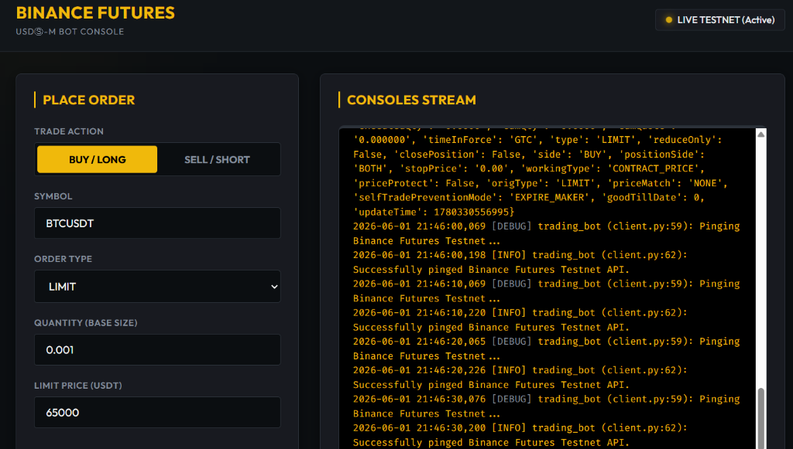
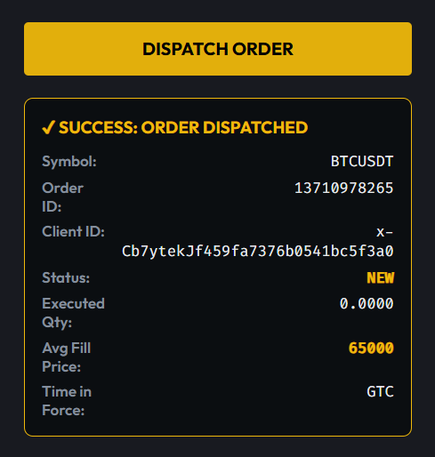

# Binance Futures Testnet Trading Bot (USDT-M)

A Python application designed to place orders on the **Binance Futures Testnet (USDT-M)**. It features a clean, professional, multi-layered architecture, strict pre-flight input validation, granular logging to both file and console, and robust error handling.

---

## Architecture Design

The bot is structured to separate concerns cleanly:

```
trading_bot/                 # Project Root
│
├── api.env                 # API Credentials (User-supplied, ignored in Git)
├── requirements.txt         # Pre-configured Python requirements
│
└── Bot/                     # Application Package
    ├── __init__.py          # Package interface imports
    ├── logging_config.py    # Log trace and console output configurations
    ├── validators.py        # Strict pre-flight input check rules
    ├── client.py            # API wrapper utilizing python-binance
    ├── orders.py            # Business logic for order placements
    └── cli.py               # Main CLI Entrypoint & Interactive Wizard
```

---

## Core Capabilities & Features

1. **Order Types & Sides**: Full support for both `BUY` and `SELL` across:
   * **`MARKET`** orders
   * **`LIMIT`** orders (requires `price` with `GTC` Time-In-Force)
   * **`STOP_LIMIT`** (Bonus type - underlying `STOP` order type with `price`, `stopPrice` and `GTC` Time-In-Force)
2. **Enhanced CLI UX (Bonus)**: 
   * **Standard Argument Parsing**: Trigger automated orders directly using flags (e.g. `--symbol BTCUSDT --side BUY --type MARKET --quantity 0.001`).
   * **Interactive Setup Wizard**: Running the script without flags (or with `--interactive`) starts a visually-guided prompt wizard, leading you step-by-step with live validation.
3. **Structured & Custom Logging**:
   * Outgoing request parameters, API payloads, network logs, and error traces are recorded in `Logs/trading_bot.log`.
   * Console logs are clean and color-coded (`[INFO]`, `[DEBUG]`, `[ERROR]`) for quick visual auditing.
4. **Resilient Error Handling**:
   * Pre-flight input validates parameters locally *before* hitting the endpoints.
   * Catches and formats Binance API errors (`BinanceAPIException`) and generic connection failures elegantly.

---

## Setup Instructions

### Verify dependencies
The environment is pre-configured with a virtual environment `venv` and the dependencies are already installed. If running from another environment, you can install dependencies using:
```bash
pip install -r requirements.txt
```

---

### A. Place a Market Order (CLI Flags)
Place a `BUY` market order for `0.001` BTC:
```bash
venv\Scripts\python Bot/cli.py --symbol BTCUSDT --side BUY --type MARKET --quantity 0.001
```

### B. Place a Limit Order (CLI Flags)
Place a `SELL` limit order for `0.001` BTC at price `$68,000`:
```bash
venv\Scripts\python Bot/cli.py --symbol BTCUSDT --side SELL --type LIMIT --quantity 0.001 --price 68000
```

### C. Place a Stop-Limit Order (CLI Flags)
Place a Stop-Limit order to `BUY` `0.001` BTC, triggered at `$65,900` with limit price `$66,000`:
```bash
venv\Scripts\python Bot/cli.py --symbol BTCUSDT --side BUY --type STOP_LIMIT --quantity 0.001 --price 66000 --stop-price 65900
```


### D. Run the Web UI Dashboard (Bonus)
To launch the Web UI dashboard served locally by Flask:
```bash
venv\Scripts\python Bot/web_server.py
```
Once the server starts, open your web browser and navigate to:
👉 **`http://127.0.0.1:5000`**

From the dashboard you can switch sides (BUY/SELL), enter parameters, place orders (Market, Limit, and Stop-Limit), and watch the Central Trading Logs scroll live in the terminal panel!

#### Web UI Dashboard Preview:


#### Order Success Result Preview:


---

## Error Handling & Validation Auditing

If you supply invalid inputs, the validator throws clear local exceptions:
```text
[CLI INPUT ERROR] Quantity -0.005 must be greater than zero.
```

If the API rejects a order (e.g., minimum lot size issues, incorrect symbol name), the bot catches the raw exception and presents it cleanly:


All detailed raw requests and responses are persistently logged inside `Logs/trading_bot.log` for troubleshooting.
